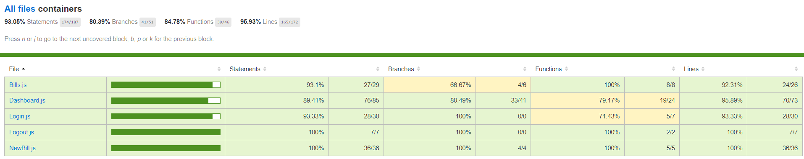

# Billed app

## Presentation
Tested and debugged SaaS RH


Employee path:


Admin path:


## Project goals
### 1. Debugg application. Issues [here](https://openclassrooms.notion.site/a7a612fc166747e78d95aa38106a55ec?v=2a8d3553379c4366b6f66490ab8f0b90)

### 2. Cover application by unit and integration tests. 
   
   Coverage report:
   
   

### 3. Create an E2E testing strategy for employee path.
   E2E plan [here](https://github.com/ZhannaZucher/Billed-app-FR-Front/blob/main/E2E_strategy.pdf)


## Project setup
1. Install the source code to run the API forking and cloning it from [here](https://github.com/OpenClassrooms-Student-Center/Billed-app-FR-back)

2. Clone the UI source code [here](https://github.com/ZhannaZucher/Billed-app-FR-Front)

### Step 1 -  Launch backend :

Follow instructions to launch the API disponible in Backend repo[here](https://github.com/OpenClassrooms-Student-Center/Billed-app-FR-Front/blob/main/README.md). 

### Step 2 - Launch frontend :

Install the dependencies with <code>npm install</code> command in the terminal.

Launch the application with your Live Server


## User accounts :

Sign in with created accounts:

### admin : 
```
user : admin@test.tld 
password : admin
```
### employee :
```
user : employee@test.tld
password : employee
```
